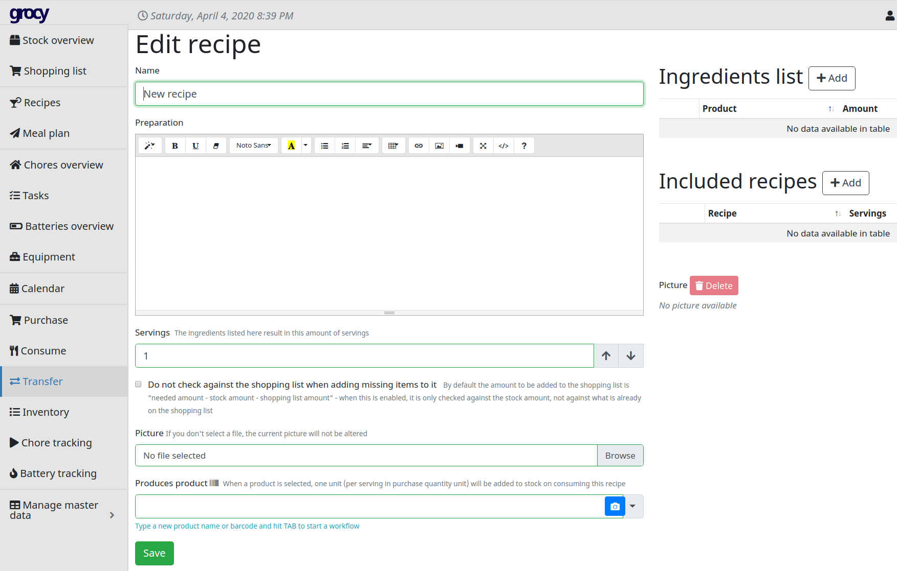
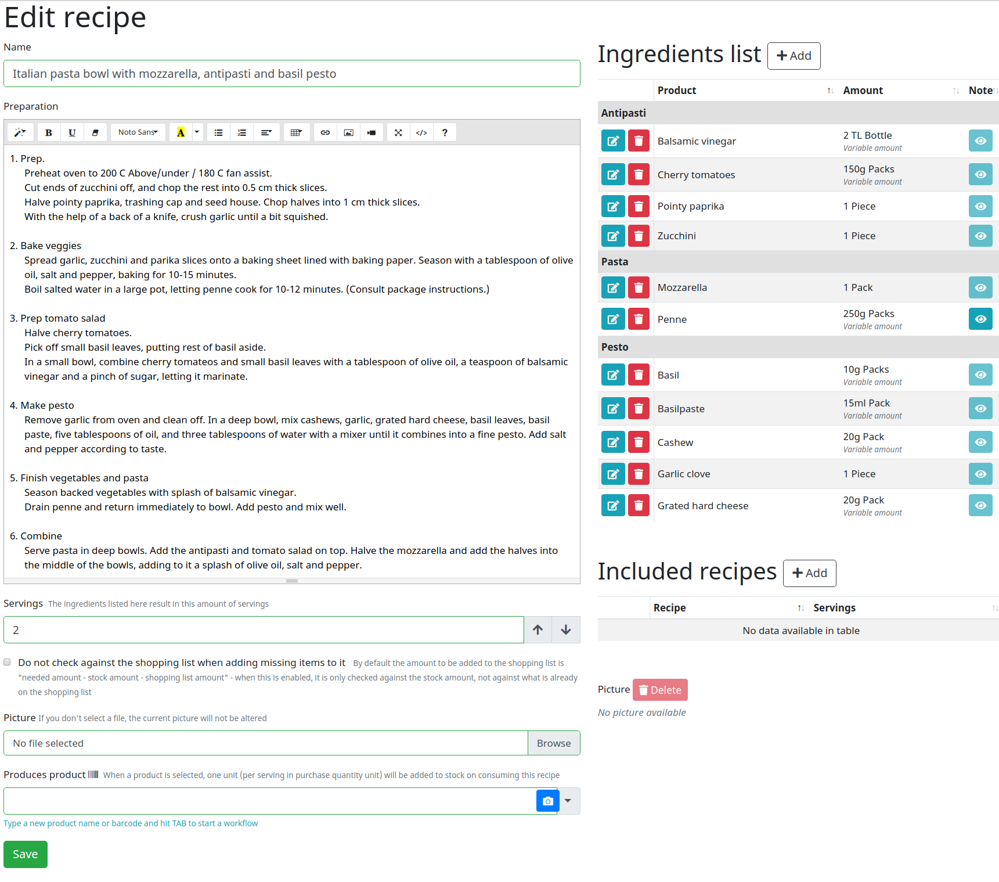
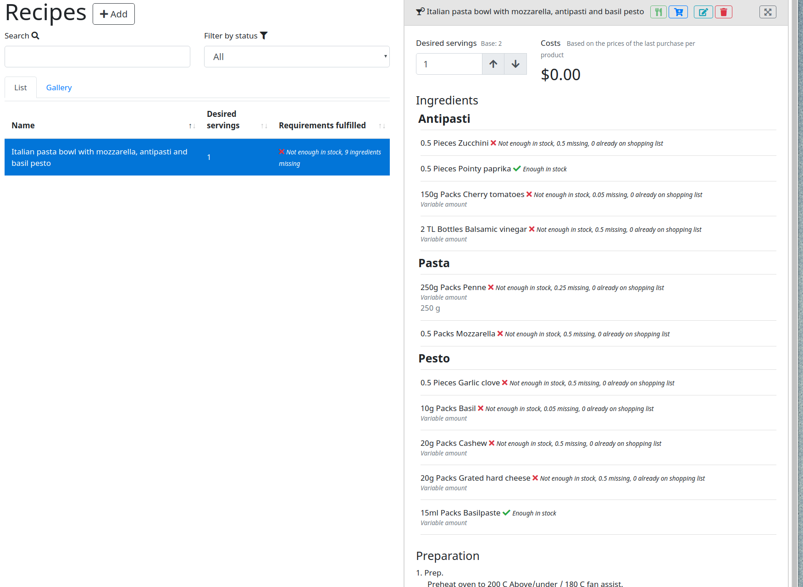

# Use: track your cooking!
Grocy lets you keep all your recipes in one place, use them in meals plans, and even browse which of your recipes uses and ingredient that you already have!

## Recipes

### Add a new recipe

1. Navigate to recipes on the side menu and click add.

2. Fill out ingredients
  - Don't worry if you haven't added one to your products before: by pressing tab after filling out the name, a product window will pop up, letting you fill out all the details.
  - Under variable amount you can set amounts that are different from your stock and purchase amounts and units. This will show up instead of the number under Amount.
  - Disable stock fulfillment checking for this ingredient - if checked, the system won't check if you have any of this stocked.
  - Group allows you to have sections in your ingredients list.
3.Fill out your instructions
4. Add serving amount
 

### Working with recipes

Once you added your recipes, you can see them all under the recipes side menu.

If you select a recipe, you can also see all at once what you have in stock, that is, what you can make! The icons on top also let you to consume (that is, remove the given amount from your inventory), put missing products onto your shopping list, as well as edit or delete the recipe itself. When the products have prices attached, the total cost will also be displayed.

## Meal plan
